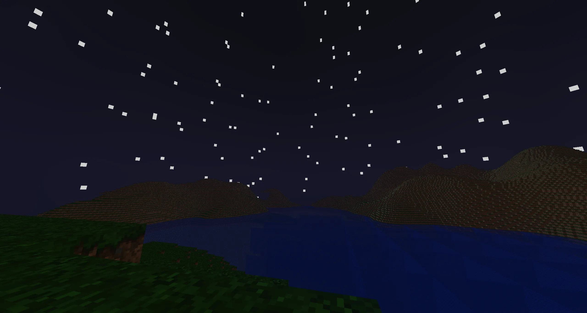
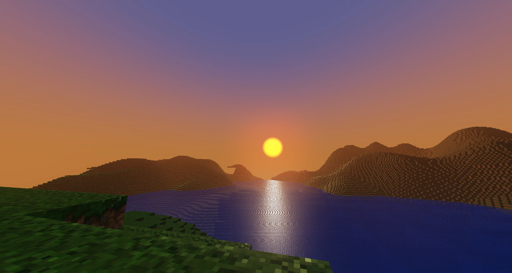

# MagmaCraft

## A Custom Voxel Multiplayer Game

**MagmaCraft** is a voxel-based sandbox game built entirely from scratch using C++ and OpenGL. Built upon my **Magma Framework**, it serves as a technical showcase of voxel rendering, client-server networking, and entity management.

## Key Features

* **Custom Voxel Engine:** Multithreaded chunk rendering, texture atlasing, and world streaming.
* **Multiplayer Networking:** Robust client-server architecture with the help of **ENet**.
* Supports Hosting and Joining worlds.
* Entity interpolation for smooth movement across the network.
* Real-time player synchronization and connection handling.

* **3D Rendering:** Custom rendering pipeline supporting FBX model loading, shaders, and dynamic textures.
* **World Management:** Infinite terrain generation with chunk compression and saving/loading systems.
* **User Interface:** ImGUI for server browsing, login, and in-game crosshair using Low Level Game Dev's GLUI library.

## Tech Stack

* **Language:** C++ (C++20)
* **Graphics:** OpenGL 4.6
* **Networking:** ENet
* **Windowing/Input:** SDL3
* **Math:** GLM
* **Build System:** CMake

## Getting Started

MagmaCraft uses **CMake** for cross-platform building.

1. **Clone the Repository** (Ensure you have Visual Studio or a C++ compiler installed).
2. Open Visual Studio and select **File -> Open -> CMake Project**.
3. Navigate to the repository folder and select `CMakeLists.txt`.
4. Allow CMake to configure the project (dependencies are managed via Vcpkg or submodules where applicable).
5. Select `MagmaFramework.exe` as the startup item and run!

**Note:** Ensure the `resources` folder is in your working directory or next to the executable for textures and models to load correctly.

## Controls

* **W, A, S, D**: Move
* **E, Q**: Fly up and down
* **Mouse**: Look
* **Esc**: Release Mouse

## Resources Used

* Faithful 32x Texture Pack - https://www.curseforge.com/minecraft/texture-packs/classic-faithful-32x
* ENet Tutorial - https://www.youtube.com/watch?v=NbhYi_I5T4A&t=417s
* Minecraft Terrain Generation - https://youtu.be/CSa5O6knuwI?si=UNLTEuHob74eRqvv

## License

MagmaCraft is open source and available under the **MIT License**. Feel free to use the underlying Magma Framework for your own learning or game projects.

**Created by Giovanni Perez Colon**
