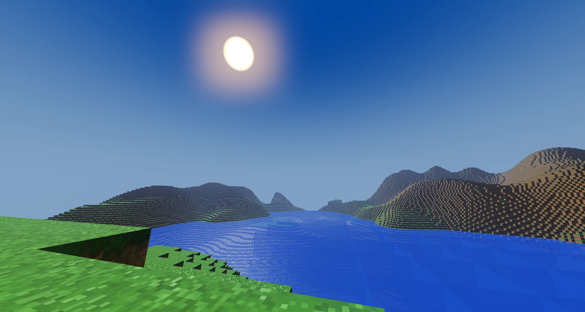
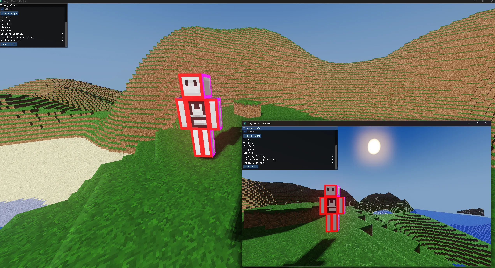

# MagmaCraft

## A Custom Voxel Multiplayer Game

**MagmaCraft** is a voxel-based sandbox game built entirely from scratch using C++ and OpenGL. Built upon my **Magma Framework**, it serves as a technical showcase of voxel rendering, client-server networking, and entity management.

## Key Features

* **Custom Voxel Engine:** Multithreaded chunk rendering, world streaming, and Deferred PBR shading.
* **Multiplayer Networking:** Robust client-server architecture with the help of **ENet**.
* Supports Hosting and Joining worlds.
* Entity interpolation for smooth movement across the network.
* Real-time player synchronization and connection handling.

* **3D Rendering:** Custom rendering pipeline supporting FBX model loading, shaders, and dynamic textures.
* **World Management:** Infinite terrain generation with chunk compression and saving/loading systems.
* **User Interface:** ImGUI for server browsing, login, and in-game crosshair using Low Level Game Dev's GLUI library.

## Tech Stack

* **Language:** C++ (C++20)
* **Graphics:** OpenGL 4.6
* **Networking:** ENet
* **Windowing/Input:** SDL3
* **Math:** GLM
* **Build System:** CMake

## Getting Started

**Option A: Quick Play (Windows)**

1. Download the latest `.zip` from the **Releases** page.
2. Extract the contents to a folder.
3. Run `MagmaCraft.exe`.

**Option B: Build from Source**

MagmaCraft uses **CMake** for cross-platform building.

1. **Clone the Repository** (Ensure you have Visual Studio or a C++ compiler installed).
2. Open Visual Studio and select **File -> Open -> CMake Project**.
3. Navigate to the repository folder and select `CMakeLists.txt`.
4. Allow CMake to configure the project (dependencies are managed via Vcpkg or submodules where applicable).
5. Select `MagmaCraft.exe` as the startup item and run!

**Note:** Ensure the `resources` folder is in your working directory or next to the executable for textures and models to load correctly.

## Controls

* **W, A, S, D**: Move
* **E, Q**: Fly up and down
* **Shift**: Speed Up
* **Mouse**: Look
* **Esc**: Toggle Mouse Capture
* * **F2**: Screenshot

## 0.3.5 Changelog

* **Graphics:** Implemented Deferred Rendering with a forward pass for transparency.
* **PBR:** Added Physically Based Rendering material support.
* **World:** Implemented Vertical Chunks.
* **Post-Processing:** Improved HDR, Bloom, and Fog.
* **Shadows:** Added directional sun shadows.
* **Terrain:** New Multi-Noise terrain generation.
* **System:** Added Chunk Region file system and Tracy Profiler implementation.

## What's Next

* **Optimization:** Reverting 3D Chunks (16x16x16) to Vertical Columns (16x512x16) to improve server stability and throughput.
* **Shadows:** Implementation of Cascaded Shadow Maps (CSM) for long-distance shadows.
* **Profiling:** Improved Tracy Profiler implementation for better optimization.
* **Visuals:** Updating terrain texture maps to fix mipmapping artifacts.
* **Lighting:** Local point lights and point shadows for emissive blocks.
* **Polish:** Fixing mesh generation bugs at chunk borders.

## Resources Used

* Faithful 32x Texture Pack - https://www.curseforge.com/minecraft/texture-packs/classic-faithful-32x
* ENet Tutorial - https://www.youtube.com/watch?v=NbhYi_I5T4A&t=417s
* Minecraft Terrain Generation - https://youtu.be/CSa5O6knuwI?si=UNLTEuHob74eRqvv

## License

MagmaCraft is open source and available under the **MIT License**. Feel free to use the underlying Magma Framework for your own learning or game projects.

**Created by Giovanni Perez Colon**
